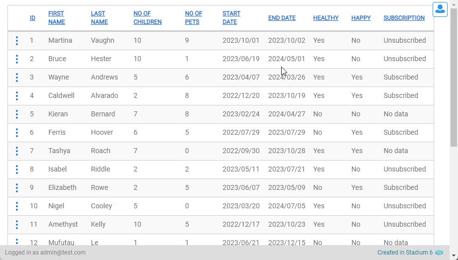
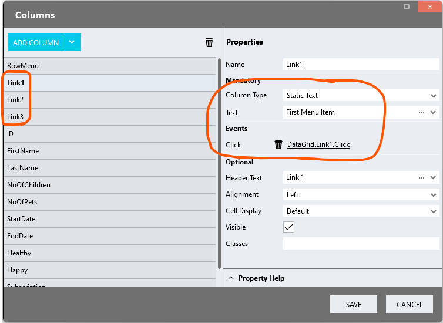

# DataGrid Row Menu <!-- omit in toc -->

This module allows for the display of *DataGrid* columns containing clickable links under a menu. 



# Version
1.1 'Search' bug fix

1.2 'Selectable column' bug fix

1.3 'Empty DataGrid' bug fix

1.3.1 Updated px to rem; fixed box-shadow

1.4 Integrated CSS into script

# Setup

## Database, Connector and DataGrid
1. Use the instructions from [this repo](https://github.com/stadium-software/samples-database) to setup the database and *DataGrid* for this sample

## Application Setup
1. Check the *Enable Style Sheet* checkbox in the application properties

## Global Script
1. Create a Global Script called "DataGridRowMenu"
2. Add the input parameters below to the Global Script
   1. CloseOnLinkClick
   2. DataGridClass
   3. MenuColumn
   4. MenuItemColumns
3. Drag a *JavaScript* action into the script
4. Add the Javascript below unchanged into the JavaScript code property
```javascript
/* Stadium Script v1.4 https://github.com/stadium-software/datagrid-row-menu */
let scope = this;
let menuItems = ~.Parameters.Input.MenuItemColumns;
let menuColumn = ~.Parameters.Input.MenuColumn;
let dgClass = ~.Parameters.Input.DataGridClass;
let closeOnClick = ~.Parameters.Input.CloseOnLinkClick;
if (typeof dgClass == "undefined") {
    console.error("The DataGridClass parameter is required");
    return false;
}
let dgClassName = "." + dgClass;
let dg = document.querySelectorAll(dgClassName);
if (dg.length == 0) {
    console.error("The class '" + dgClass + "' is not assigned to any DataGrid");
    return false;
} else if (dg.length > 1) {
    console.error("The class '" + dgClass + "' is assigned to multiple DataGrids. DataGrids using this script must have unique classnames");
    return false;
} else {
    dg = dg[0];
}
dg.classList.add("stadium-row-menu-datagrid");
let getObjectName = (obj) => {
    let objname = obj.id.replace("-container", "");
    do {
        let arrNameParts = objname.split(/_(.*)/s);
        objname = arrNameParts[1];
    } while ((objname.match(/_/g) || []).length > 0 && !scope[`${objname}Classes`]);
    return objname;
};
let datagridname = getObjectName(dg);
let table = dg.querySelector("table");
let dataGridColumns = getColDefinition();

let options = {
    characterData: true,
    childList: true,
    subtree: true,
};
let observer = new MutationObserver(addMenu);
loadCSS();
addMenu();
observer.observe(table, options);

document.addEventListener("click", function (ev) {
    if (!ev.target.closest(".stadium-row-menu") && !ev.target.closest(".stadium-row-menu-icon")) {
        hideMenu();
    }
});
document.onkeydown = function (evt) {
    evt = evt || window.event;
    let isEscape = false;
    if ("key" in evt) {
        isEscape = evt.key === "Escape" || evt.key === "Esc";
    } else {
        isEscape = evt.keyCode === 27;
    }
    if (isEscape) {
        hideMenu();
    }
};
function addMenu() {
    observer.disconnect();
    let obname = getObjectName(dg);
    let selectCol = 0;
    if (scope[`${obname}HasSelectableData`]) selectCol = 1;
    for (let i = 0; i < menuItems.length; i++) {
        let menuItemColIndex = getElementIndex(dataGridColumns, menuItems[i]);
        scope[`${obname}ColumnDefinitions`][menuItemColIndex - selectCol].visible = false;
    }
    let menuColIndex = getElementIndex(dataGridColumns, menuColumn);
    let rows = table.querySelectorAll("tbody tr");
    if (rows.length > 0 && rows[0].querySelector("td:nth-child(1)").textContent.indexOf("No data to display.") == -1) {
        rows.forEach(function (row) {
            if (!row.querySelector(".stadium-row-menu")) {
                let menuTd = row.querySelector("td:nth-child(" + (menuColIndex + 1) + ")");
                let kebab = menuTd.querySelector("button");
                if (!kebab) {
                    kebab = document.createElement("button");
                    kebab.classList.add("btn", "btn-lg", "btn-link");
                    menuTd.textContent = '';
                    menuTd.appendChild(kebab);
                }
                kebab.classList.add("stadium-row-menu-icon");
                let menu = document.createElement("div");
                menu.classList.add("stadium-row-menu");
                menuTd.appendChild(menu);
                kebab.addEventListener("click", function (ev) {
                    handleMenu(ev.target);
                });
            }
        });
    }
    observer.observe(table, options);
}
function handleMenu(el) {
    let openMe = !el.closest("td").classList.contains("open");
    hideMenu();
    if (openMe) {
        let cell = el.closest("td");
        cell.classList.add("open");
        let menu = cell.querySelector(".stadium-row-menu");
        let row = cell.closest("tr");
        if (cell.querySelectorAll(".stadium-row-menu-item").length == 0) {
            menuItems.forEach(function (item) {
                let menuItemIndex = getElementIndex(dataGridColumns, item);
                let menuItemLink = row.querySelector("td:nth-child(" + (menuItemIndex + 1) + ") button");
                let menuItem = document.createElement("div");
                menuItem.classList.add("stadium-row-menu-item");
                menuItem.addEventListener("click", function () {
                    if (closeOnClick) { 
                        hideMenu();
                    }
                });
                menuItem.appendChild(menuItemLink);
                menu.appendChild(menuItem);
            });
        }
    }
}
function hideMenu() {
    let menuParent = dg.querySelector("td.open");
    if (menuParent) menuParent.classList.remove("open");
}
function getColDefinition() {
    let cols = [];
    let colDefs = scope[`${datagridname}ColumnDefinitions`];
    if (table.querySelector("thead th:nth-child(1) input[type=checkbox")) cols.push("RowSelector");
    for (let i = 0; i < colDefs.length; i++) {
        cols.push(colDefs[i].name);
    }
    return cols;
}
function getElementIndex(haystack, needle) {
    return haystack.indexOf(needle);
}
function loadCSS() {
    let moduleID = "stadium-datagrid-row-menu";
    if (!document.getElementById(moduleID)) {
        let cssMain = document.createElement("style");
        cssMain.id = moduleID;
        cssMain.type = "text/css";
        cssMain.textContent = `
.stadium-row-menu-datagrid {
    .stadium-row-menu-icon,
    .stadium-row-menu-icon:active {
        background-image: var(--stadium-row-menu-icon, url("data:image/svg+xml,%3Csvg xmlns='http://www.w3.org/2000/svg' width='1em' height='1em' viewBox='0 0 16 16'%3E%3Cg fill='none' stroke='%231976d2' stroke-linecap='round' stroke-linejoin='round' stroke-width='1.5'%3E%3Ccircle cx='8' cy='2.5' r='.75'/%3E%3Ccircle cx='8' cy='8' r='.75'/%3E%3Ccircle cx='8' cy='13.5' r='.75'/%3E%3C/g%3E%3C/svg%3E"));
        background-repeat: no-repeat;
        background-size: var(--stadium-row-menu-icon-size, 2rem);
        background-position: center;
        height: var(--stadium-row-menu-icon-size, 2rem);
        width: var(--stadium-row-menu-icon-size, 2rem);
        cursor: pointer;
        z-index: 101;
    }
    .open {
        .stadium-row-menu {
            display: flex;
        }
        .stadium-row-menu-icon {
            position: relative;
        }
    }
    td:has(.stadium-row-menu) {
        position: relative;
    }
    .stadium-row-menu {
        z-index: 100;
        background-color: var(--stadium-row-menu-background-color, var(--BODY-BACKGROUND-COLOR, #ffffff));
        display: none;
        flex-direction: column;
        position: absolute;
        top: var(--stadium-row-menu-top-position, 0.2rem);
        left: var(--stadium-row-menu-left-position, 0.8rem);
        right: var(--stadium-row-menu-right-position, unset);
        box-shadow: var(--stadium-row-menu-box-shadow, var(--BOX-SHADOW-COLOR, rgba(100, 100, 111, 0.2)) 0 0.7rem 2.9rem 0);
        border: var(--stadium-row-menu-border-width, 0.1rem) solid var(--stadium-row-menu-border-color, var(--GENERAL-BORDER-COLOR, #ccc));
        border-radius: var(--stadium-row-menu-border-radius, 0.4rem);
    }
    table.table>tbody>tr>td .stadium-row-menu-item {
        padding: var(--stadium-row-menu-item-top-padding, 0.6rem) var(--stadium-row-menu-item-right-padding, 1.2rem) var(--stadium-row-menu-item-bottom-padding, 0.6rem) var(--stadium-row-menu-item-left-padding, 2rem);
        button {
            color: var(--stadium-row-menu-item-font-color, var(--LINK-COLOR, inherit));
            font-size: var(--stadium-row-menu-item-font-size, var(--FONT-SIZE-SMALL, 1.2rem));
            text-decoration: var(--stadium-row-menu-item-underline, var(--LINK-DECORATION, none));
            width: 100%;
        }
        button:hover {
            color: var(--stadium-row-menu-item-hover-font-color, var(--LINK-COLOR, inherit));
            text-decoration: var(--stadium-row-menu-item-hover-underline, var(--LINK-HOVER-DECORATION, underline));
        }
    }
}
html {
    min-height: 100%;
    font-size: 62.5%;
}        
        `;
        document.head.appendChild(cssMain);
    }
}
```

## Page
1. Drag a *DataGrid* control to the page
2. Add a unique class to the DataGrid Classes property (e.g. row-menu)
3. Set up the data bound columns as per normal
4. Add one column to contain the menu (e.g. RowMenu)
5. Change the *Column Type* to "Static Text"
6. Set the *Text* and *Header Text* properties to empty by adding: =''


7. Add any number of columns with a *Click* event handler (e.g. Link1, Link2, Link3)
8. Change the *Column Type* to "Static Text"



## Page.Load


1. Drag your query or WebService call into the event handler
2. Assign the data to the *DataGrid* control
3. Drag a *List* of *Type* "Any" into the event handler and name it "MenuItemColumnsList"
4. Add the names of the link columns you want to show in the menu as *List* items in the order in which you want them to appear


5. Drag the "DataGridRowMenu" script under the *List* in the event handler
6. Complete the script input parameters
   1. CloseOnLinkClick: Set this to true to close the menu when a link is clicked
   2. DataGridClass: The unique class you added to the *DataGrid* control (e.g. row-menu)
   3. MenuColumn: The name of the column where the menu will be shown (e.g. RowMenu)
   4. MenuItemColumns: The list of columns called "MenuItemColumnsList" that will become the menu items

## CSS
Some elements can be [customised](#customising-css) using a variables CSS file. 

### Customising CSS
1. Open the CSS file called [*datagrid-row-menu-variables.css*](datagrid-row-menu-variables.css) from this repo
2. Adjust the variables in the *:root* element as you see fit
3. Overwrite the file in the CSS folder of your application with the customised file
4. Do not change any CSS other than the variables provided in the *-variables.css file

### CSS Upgrading
To upgrade the CSS in this module, follow the [steps outlined in this repo](https://github.com/stadium-software/samples-upgrading)

## Working with Stadium Repos
Stadium Repos are not static. They change as additional features are added and bugs are fixed. Using the right method to work with Stadium Repos allows for upgrading them in a controlled manner. How to use and update application repos is described here 

[Working with Stadium Repos](https://github.com/stadium-software/samples-upgrading)